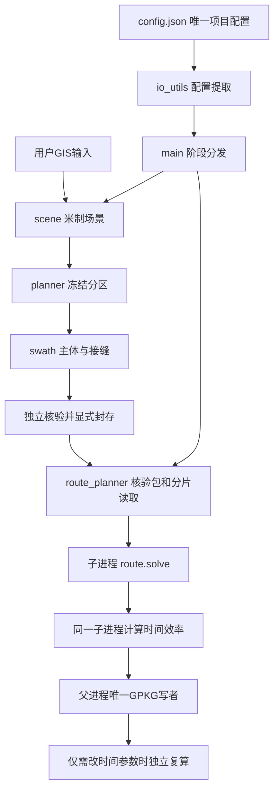

# AgriWeave 1.0.0（内核V7.0.10） 架构与代码阅读指南

更新日期：2026-10-06（Asia/Manila）。本工程生成完整几何参考路线及配置下的时间效率。正式源码十一模块；本轮补充注释，计算语句、条件、默认数值和调用逻辑保持不变。

## 从哪里开始阅读

先看根目录 [README](../README.md) 运行人工三田完整流程，再看 [配置说明](CONFIGURATION.md) 和 [结果字段](RESULTS.md)。main.py 是总入口，io_utils.py 管理唯一 config.json 的提取；数据用 通过--input指定GIS文件，输出和缓存用本项目outputs。

| 正式模块 | 输入与职责 | 输出/边界 |
|---|---|---|
| main.py | 解析参数、选择阶段、隔离历史full求解 | 不实现第二套路线算法；默认不运行所有阶段 |
| io_utils.py | 原子写JSON、配置结构/模式提取、旧路径适配 | _help不参与计算；外部旧配置按原内容读取 |
| scene.py | 读取GIS或场景、车辆和基础规划参数 | 本田局部米制Scene，保留target覆盖义务与travel通行区 |
| planner.py | 场景分区、通行拓扑及原生F2C适配 | WorkRegionAnalysis；分区筛查不等于运动通过 |
| swath_planner.py | 冻结分区的主体候选搜索、统一面积门槛、局部转向检查 | 主体条带与机具扫掠，未认证转向另报 |
| swath_seams.py | 真实跨区扫掠、重叠预算与代作归属 | 不把区内搭接误计为跨区接缝，不改目标所属区 |
| swath_batch.py | 原始GIS/单田主体阶段并行、结果导出 | swath_results.gpkg及本阶段账本，输出协议不同于参考路线 |
| route.py | 严格、规则、几何参考、配置运动模型的求解 | 对应策略有序段和分项状态，保持冻结任务义务 |
| route_planner.py | 可信包核验、隔离计算、单写者事务、恢复和独立回读 | 默认reference_routes.gpkg逐田提交；旧策略保留历史协议 |
| validator.py | 运动、包络、连续性、覆盖核验及旧API映射 | 通过范围取决于实际检查；旧模块名只转发到真实实现 |
| calculate_work_time_efficiency.py | 消费已有有序路线及时间模型，独立复算 | 不重新规划；整田效率与明细逐田写GPKG |

## 当前推荐调用链

swaths、routes、efficiency 是分别调用的阶段。routes 消费已封存主体，不会先暗中重新规划条带；efficiency 读取已有路线，不会重新连接路径。main.py 的历史 full 阶段具有原完整候选/修补流程，与当前推荐三步流程不同。

阅读核心符号：main.main；io_utils.project_config/config_section/scene_config；scene.load_scene；planner.analyze_work_regions；swath_planner.generate_region_swaths；swath_seams.audit_seams；route_planner.seal_swath_bundle/_verify_bundle/run_incremental_reference_batch；route.solve/assemble_geometry_reference；calculate_work_time_efficiency.compute_reference_efficiency/run_batch；route_planner.ReferenceStore。

## 策略范围

| config路线模式 | 实际用途 | 不应推断的结论 |
|---|---|---|
| reference | 默认完整几何参考，柔和连接并接入有序田头 | 不认证真实半径、挡位、压苗或田门 |
| geometry | 历史主体几何对照，未开启完整田头组装 | 不等于完整参考路线/整田效率 |
| operational | 原生车辆运动、刚性车体/固定机具、作物时序模型对照 | 配置模型通过不等于实车认证 |
| strict | 采用RouteSettings默认值的历史严格搜索 | 搜索失败不证明物理不可达 |
| separate_headland | 历史独立田头圈与主体组织 | 圈数或有线不代替覆盖验收 |

REGULAR_HEADLAND_FIRST 规则策略仍在route.py中，根配置没有将它选为日常模式；不能把所有策略的输出图层、时间模型和PASS混用。

## 坐标、任务与覆盖

Scene.target是目标作业义务，Scene.travel是合法通行空间。安全核心只是辅助筛查，不能通过缩小target让覆盖“通过”。输入GIS先投影为米制，再减去本田原点；内部yaw为弧度，场景起终姿态JSON的朝向是度。长度m、面积m²、速度m/s、时间s。显示geom与原始米制WKB分别用于GIS和验算。

FrozenTask 保留编号、所属区、参考线及真实扫掠。车辆反向遍历需要保持机具覆盖并重算端点，不能直接沿用原方向连接。跨区代作同时记录目标归属和实际作业提供方。

主体95%约束比较同一分区所有已检查有效候选的最大主体面积Amax，不是“整田只覆盖95%就算成功”。选定主体仍须按独立义务检查覆盖；田头、待作和主体面积账本分别保留。

## 并行与持久化

默认reference使用spawn隔离单田路线和效率计算，父进程按分片读取并作为唯一GPKG写者。默认请求上限12；启动时按空闲CPU采样、CPU/affinity/cgroup硬上限及内存估计选核，workers=0自动、正值是可超过12的请求上限。多田条带也在main入口限流，不改变冻结单田算法。调度数在本次运行内固定；每工作进程数值库线程设置为1。单田内部仍串行，资源估计不是OS硬RSS限制。

field_results状态是PENDING→RUNNING→COMPLETED/FAILED；完成表示已提交计算结果，另看路线、效率、覆盖和风格状态。一次事务保存单田空间结果、时间账本和完成状态。断点续算检查输入、源码、路线和效率参数合同，可调整调度资源。

默认协议V7_COMPACT_REFERENCE_2的完整路线唯一账本是route_segments。原body_work/reference_operations/full_reference_itinerary等图层属于历史协议，不与默认账本重复累计。属性表和米制压缩WKB也是结果的一部分，不能只留下显示线。

## 历史兼容与源码修改

validator末尾的薄属性视图由config.compatibility.legacy_api映射保护；新代码直接引用正式模块。旧导入需要先import validator初始化，不另建重复算法。

本轮用户授权全src中文说明补充，五个原冻结模块也只改文档串/注释。剔除文档串后逐模块AST一致；源码字节摘要仍会变化，旧合同不能被改写来冒充新批次。注释也可能使旧封存输入的源码检查拒绝，必要时由原始数据重新生成、审计和封存。后续算法冻结规则见根目录AGENTS.md。
